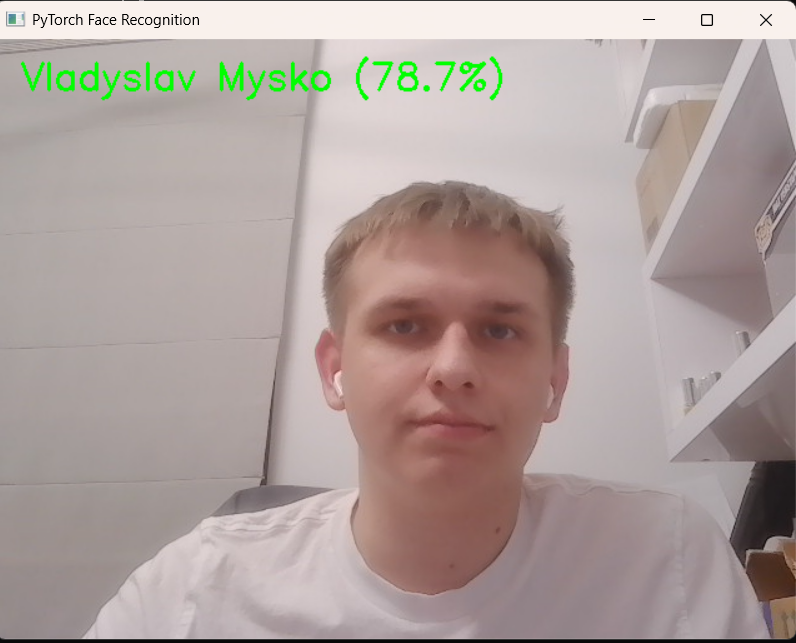
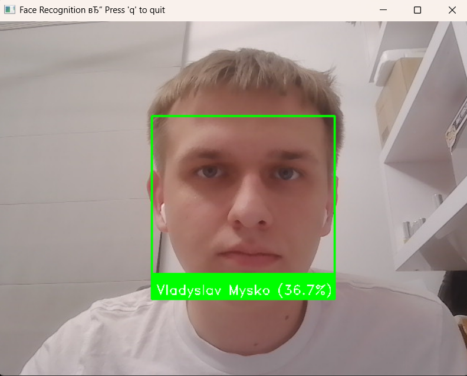
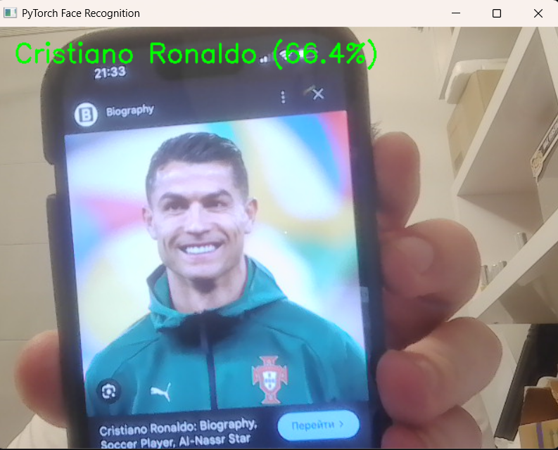
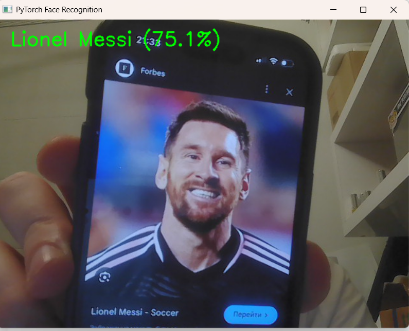

# HW3 - Face Recognition

Mini face-recognition lab that explores two pipelines:
- Baseline using the `face_recognition` (dlib) library.
- Custom PyTorch pipeline using FaceNet embeddings + linear SVM.

Artifacts and folders:
- `dataset/`: raw images in subfolders per person (from `get_dataset.py` or your own photos).
- `dataset_cropped/`: face crops generated by `get_ds.py`.
- `embeddings.npy`, `pytorch_classifier.pkl`, `pytorch_labelencoder.pkl`: trained PyTorch artifacts.
- `face_recog_example_vlad.png`, `mymodel_*.png`: example outputs/screenshots.

## Environment
```bash
python -m venv .venv
.\.venv\Scripts\activate      # or source .venv/bin/activate on macOS/Linux
pip install face_recognition opencv-python facenet-pytorch torch torchvision torchaudio scikit-learn joblib numpy
```
`face_recognition` on Windows requires CMake + Visual Studio Build Tools for dlib.

## Data preparation
Option A: download a ready dataset (LFW subset):
```bash
python get_dataset.py
```
Option B: place your own photos in `dataset/<person_name>/`.

Then auto-crop faces to a consistent 160x160 size:
```bash
python get_ds.py
```
This builds `dataset_cropped/` using OpenCV Haar cascades.

## Train the PyTorch model
Generates FaceNet embeddings and fits a linear SVM:
```bash
python train_my_model.py
```
Outputs `embeddings.npy`, `pytorch_classifier.pkl`, and `pytorch_labelencoder.pkl`.

## Run real-time PyTorch inference
Uses MTCNN + FaceNet + the trained SVM on webcam frames:
```bash
python realtime_pytorch_model.py
```
Press `q` to quit. Predictions turn green when confidence > 50%.

## Run the baseline face_recognition demo
Matches webcam faces against encodings built from `dataset/`:
```bash
python face_recog.py
```
Press `q` to quit. The confidence shown is derived from face distance vs the 0.6 threshold.

## Screenshots
- FaceNet + SVM prediction:  
  
- Baseline `face_recognition` demo:  
  
- Additional PyTorch outputs:  
    
  

## Notes
- Keep clear, front-facing images for best results; at least a few photos per person.
- GPU is used automatically if available (`torch.cuda.is_available()`).
- If no face is detected for an image during preprocessing/training, the script will skip it and log a message.
